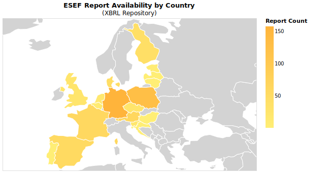
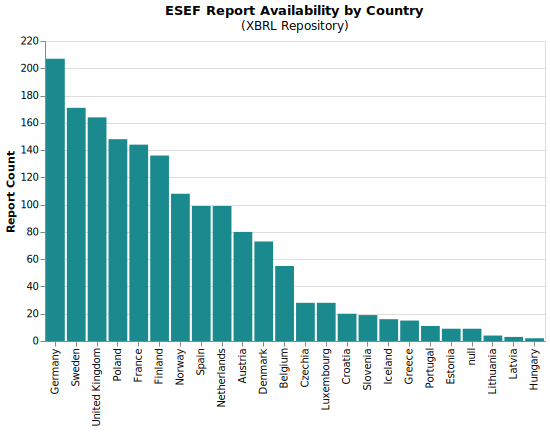
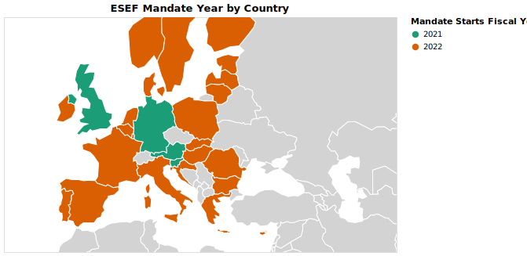
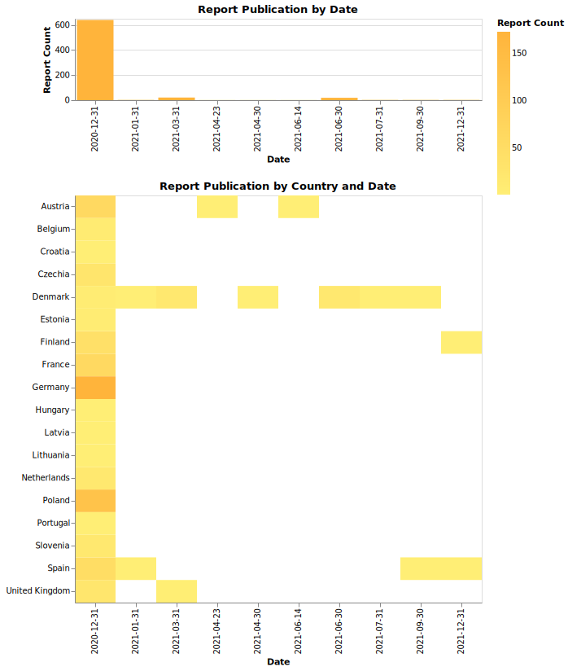
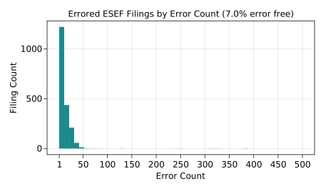
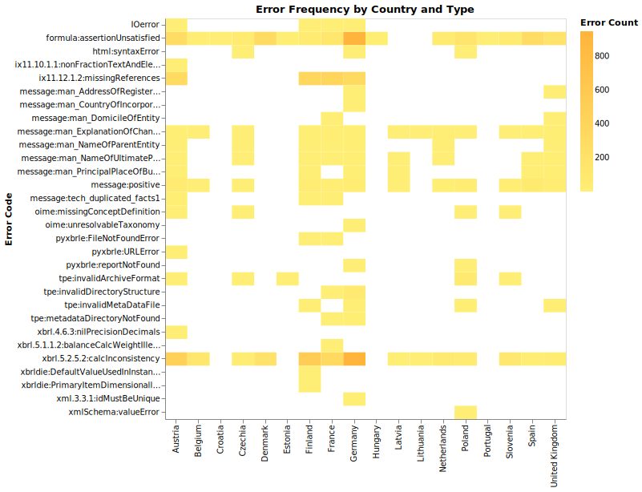
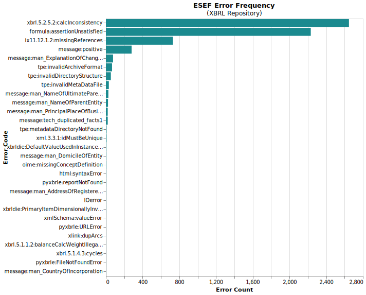

# ESEF Data Product

A project of the [Open Science Data Center][c02]

> Research Data Access for the European Single Electronic Format (ESEF)

## Resources

- [ESEF Data Collection](docs/data_collection.md)
- [ESEF Data Coverage](docs/data_coverage.md)
- [CRediT Contributor Statement](docs/contributors.yaml)

With the introduction of the European Single Electronic Format (ESEF) for annual financial reports, corporate financial data
in the European Union becomes standardized and machine-readable for the first time. Use of the format is binding for
financial year 2020 and later and as companies begin to publish using ESEF, there are significant opportunities and challenges ahead
for the accounting research community.

As part of TRR266, funding has been obtained to empower and enable research using these documents.
By incubating this project as open source from the outset, we hope to attract contributions from academia and industry
and avoid the privatization of this emerging open data resource.

[ESEF is a standard based on XBRL][esef_home], but it is not a document repository. ESEF has been adopted by the 27 nations
of the European Union as well as Norway and Iceleand.
[Each country is responsible for designating a national database][competent_authorities].

## Project Modules

1. A dashboard which tracks ESEF availability by country and filing quality by country and company
2. A dataset which identifies all firms ('issuer') subject to ESEF regulation
3. An ESEF parser which reads, validates, and normalizes ESEF financial reports
4. A repository of raw filings in the ESEF format
5. Standardized ['data products'][data_product] extracted from ESEF filings

## Project Goals

1. Enable TRR researchers to do research on the basis of ESEF data
2. Gather and focus open source ESEF software efforts
3. Publicize and encourage high quality filings and easy data access by national competent authorities
4. Establish canonical 'data product schemas' for analyzing financial reporting across the European Union
5. Promote open science and open data in accounting and offer templates and tools for building on our work

## Technical Approach

1. GitHub Actions CI/CD is used to ensure that code is tested and functional at every commit
2. Pull Requests with maintainer reviews ensure code quality
3. The project will be developed 'out in the open' to avoid the 'ripping the band-aid off' experience of having to decide when to open source
4. The project will be developed under an OSS-compliant MIT license

## Project Funding

Funded by the [Deutsche Forschungsgemeinschaft (DFG, German Research Foundation)][dfg]: [Project-ID 403041268 – TRR 266 Accounting for Transparency][trr_266].

[esef_home]: https://www.esma.europa.eu/policy-activities/corporate-disclosure/european-single-electronic-format
[competent_authorities]: https://www.esma.europa.eu/access-regulated-information
[data_product]: https://martinfowler.com/articles/data-mesh-principles.html#DataAsAProduct
[trr_266]: https://www.accounting-for-transparency.de
[dfg]: https://www.dfg.de
[c02]: https://www.accounting-for-transparency.de/project/open-science-data-center/

## Datasets Used

| Dataset | License |
| -- | -- |
| [filings.xbrl.org][xbrl_filings] | None |
| [lukes/ISO-3166-Countries-with-Regional-Codes][iso_3166] | [CC BY-SA 4.0][cc_by_sa] |
| [World Atlas TopoJSON][world_atlas] | [ISC][isc] |
| [ESMA Public Data (Regulated Markets)][esma_api] | [ESMA T&C][esma_tc] |
| [Wikidata][wikidata] | [CC0][cc_0] |
## Licensing

- For code, see [LICENSE](LICENSE)
- Graphics are licensed [CC BY-SA 4.0][cc_by_sa]

[xbrl_filings]: https://filings.xbrl.org/about.html
[iso_3166]: https://github.com/lukes/ISO-3166-Countries-with-Regional-Codes
[world_atlas]: https://www.npmjs.com/package/world-atlas
[isc]: https://www.isc.org/licenses/
[cc_by_sa]: https://creativecommons.org/licenses/by-sa/4.0/
[esma_api]: https://registers.esma.europa.eu/publication/helpApp
[esma_tc]: https://registers.esma.europa.eu/publication/legalNoticePage
[wikidata]: https://www.wikidata.org/wiki/Wikidata:Main_Page
[cc_0]: https://creativecommons.org/publicdomain/zero/1.0/
